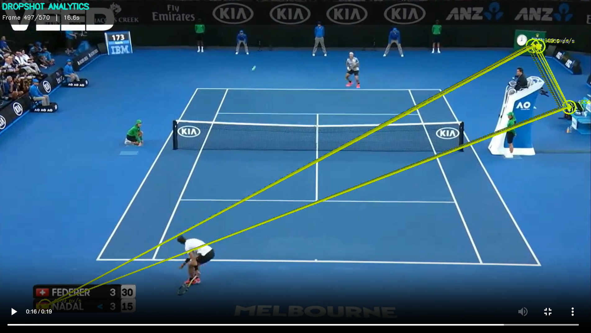

<div align="center">

# DROPSHOT

### *Every Frame. Every Angle. Every Advantage.*

**AI-Powered Tennis Video Analytics Engine**

[](https://python.org)
[](https://reactjs.org)
[](https://fastapi.tiangolo.com)
[](https://ultralytics.com)
[](https://anthropic.com)
[](LICENSE)

---

*Drop your tennis clip. Get pro-level analytics in seconds.*

</div>

---

## What is DROPSHOT?

**DROPSHOT** is a full-stack tennis video analytics platform that turns any tennis clip (up to 30 seconds) into a comprehensive breakdown of every shot, every movement, and every tactical decision — powered by custom-trained YOLOv8 models, ResNet-50 court detection, and Claude Opus 4.6 AI.

Upload a video. Get back:
- **Annotated output video** with player bounding boxes, ball trajectory trails, court keypoints, and mini-court visualization
- **Shot-by-shot analysis** — forehand, backhand, serve, volley detection with technique ratings
- **Ball tracking** — real-time trajectory with speed estimation
- **Player stats** — movement distance, speed, court coverage
- **AI-powered tactical commentary** via Claude Opus 4.6

---

## Screenshots

### Upload Page

*Clean drag-and-drop upload with real-time validation. Max 30s, 50MB.*

### Analysis Dashboard

*Comprehensive analytics: performance radar, player assessment, speed metrics, tactical notes.*

### Annotated Output Video

*YOLO-detected player boxes, ball trajectory trails with speed, court keypoints, mini-court overlay, shot detection flashes.*

---

## Architecture

```
┌─────────────────────────────────────────────────────────────┐
│                        FRONTEND                              │
│  React 18 + TailwindCSS + Shadcn/UI + Recharts              │
│  Upload → Processing Status → Analytics Dashboard            │
└────────────────────────┬────────────────────────────────────┘
                         │ HTTPS
┌────────────────────────▼────────────────────────────────────┐
│                      BACKEND (FastAPI)                        │
│                                                              │
│  ┌──────────┐  ┌───────────┐  ┌──────────────┐              │
│  │ Upload   │  │ Processing│  │  Analytics   │              │
│  │ Handler  │──│   Queue   │──│  Endpoints   │              │
│  └──────────┘  └─────┬─────┘  └──────────────┘              │
│                      │                                       │
│  ┌───────────────────▼──────────────────────────┐            │
│  │         TENNIS-VISION PIPELINE                │            │
│  │                                               │            │
│  │  ┌─────────────┐  ┌────────────────┐          │            │
│  │  │ YOLOv8x     │  │ Custom YOLO    │          │            │
│  │  │ Player Det. │  │ Ball Detection │          │            │
│  │  └──────┬──────┘  └───────┬────────┘          │            │
│  │         │                 │                    │            │
│  │  ┌──────▼─────────────────▼────────┐          │            │
│  │  │ ResNet-50 Court Keypoints       │          │            │
│  │  │ 14 landmark points detection    │          │            │
│  │  └──────┬──────────────────────────┘          │            │
│  │         │                                     │            │
│  │  ┌──────▼──────────────────────────┐          │            │
│  │  │ Mini-Court Visualization        │          │            │
│  │  │ Bird's-eye court + positions    │          │            │
│  │  └──────┬──────────────────────────┘          │            │
│  │         │                                     │            │
│  │  ┌──────▼──────────────────────────┐          │            │
│  │  │ Shot Classifier + Stats Engine  │          │            │
│  │  │ Speed, distance, coverage       │          │            │
│  │  └──────┬──────────────────────────┘          │            │
│  │         │                                     │            │
│  │  ┌──────▼──────────────────────────┐          │            │
│  │  │ Claude Opus 4.6 AI Commentary   │          │            │
│  │  │ Expert tactical interpretation  │          │            │
│  │  └────────────────────────────────┘           │            │
│  └───────────────────────────────────────────────┘            │
│                                                              │
└────────────────────────┬────────────────────────────────────┘
                         │
        ┌────────────────┼───────────────────┐
        │                │                   │
   ┌────▼─────┐   ┌─────▼──────┐   ┌───────▼──────┐
   │ MongoDB  │   │  Object    │   │   FFmpeg     │
   │ Atlas    │   │  Storage   │   │   H.264      │
   └──────────┘   └────────────┘   └──────────────┘
```

---

## Tech Stack

| Layer | Technology | Purpose |
|-------|-----------|---------|
| **Frontend** | React 18, TailwindCSS, Shadcn/UI | Dashboard UI |
| **Charts** | Recharts | Radar, Pie, Area, Bar visualizations |
| **Backend** | FastAPI (Python 3.11+) | REST API, async processing |
| **Player Detection** | YOLOv8x (Ultralytics) | Real-time player bounding boxes |
| **Ball Detection** | Custom YOLOv8 (trained on 578 images) | Tennis ball tracking |
| **Court Detection** | ResNet-50 (custom keypoints model) | 14 court landmark points |
| **AI Commentary** | Claude Opus 4.6 (Anthropic) | Expert tactical analysis |
| **Video Processing** | OpenCV + FFmpeg | Frame extraction, annotation, H.264 |
| **Database** | MongoDB | Analysis storage |
| **File Storage** | Object Storage | Video upload/download |

---

## Models

DROPSHOT uses **3 ML models** in its pipeline:

| Model | Architecture | Size | Purpose | Source |
|-------|-------------|------|---------|--------|
| `yolov8x.pt` | YOLOv8 Extra-Large | 136 MB | Player detection | Ultralytics (auto-download) |
| `last.pt` | YOLOv8 (custom-trained) | 165 MB | Ball detection | Custom trained on 578 annotated frames |
| `keypoints_model.pth` | ResNet-50 (custom head) | 91 MB | Court keypoint detection | Custom trained for 14 court landmarks |

### Training Details

**Ball Detection Model:**
- Architecture: YOLOv8
- Training data: 578 annotated tennis ball images
- Accuracy: 88% mAP

**Court Keypoint Model:**
- Architecture: ResNet-50 with regression head
- Detects 14 court landmark points
- Used for mini-court bird's-eye visualization

---

## Getting Started

### Prerequisites

```bash
# Python 3.11+
python --version

# Node.js 18+
node --version

# FFmpeg
ffmpeg -version

# MongoDB
mongod --version
```

### Installation

```bash
# Clone
git clone https://github.com/HarshTomar1234/DropShot.git
cd DropShot

# Backend
cd backend
pip install -r requirements.txt

# Download YOLOv8x (auto-downloads on first run)
# Place custom models in backend/Tennis-Vision/models/
#   - last.pt (ball detection)
#   - keypoints_model.pth (court keypoints)

# Frontend
cd ../frontend
yarn install

# Environment
cp backend/.env.example backend/.env
# Edit with your MONGO_URL and EMERGENT_LLM_KEY
```

### Running

```bash
# Backend (port 8001)
cd backend && uvicorn server:app --host 0.0.0.0 --port 8001 --reload

# Frontend (port 3000)
cd frontend && yarn start
```

---

## API Reference

| Method | Endpoint | Description |
|--------|----------|-------------|
| `GET` | `/api/` | API info |
| `GET` | `/api/health` | Health check (DB, storage, queue status) |
| `POST` | `/api/upload` | Upload tennis video (multipart/form-data) |
| `GET` | `/api/analyses` | List analyses (paginated: `?page=1&limit=20`) |
| `GET` | `/api/analyses/:id` | Get analysis details |
| `GET` | `/api/analyses/:id/output-video` | Stream annotated video |
| `GET` | `/api/analyses/:id/original-video` | Stream original video |
| `DELETE` | `/api/analyses/:id` | Delete analysis |
| `POST` | `/api/analyses/:id/retry` | Retry failed analysis |

### Upload Example

```bash
curl -X POST https://your-domain.com/api/upload \
  -F "file=@tennis_clip.mp4" \
  -H "Content-Type: multipart/form-data"
```

**Response:**
```json
{
  "id": "uuid-here",
  "status": "queued",
  "message": "Video uploaded. Processing queued.",
  "duration_sec": 15.2,
  "queue_position": 1
}
```

---

## Production Features

- **Rate Limiting** — 10 requests/minute per IP
- **Processing Queue** — Max 3 concurrent jobs, queued overflow
- **Video Compression** — FFmpeg normalization before processing
- **Retry Logic** — 3x retry with exponential backoff on storage/AI calls
- **H.264 Output** — Browser-compatible video with faststart flag
- **Pagination** — Paginated history with total count
- **Validation** — File type, size (50MB), duration (30s), codec integrity, resolution checks
- **MongoDB Indexes** — Indexed on `id`, `created_at`, `status`

---

## Project Structure

```
DropShot/
├── backend/
│   ├── server.py                    # FastAPI application
│   ├── tennis_vision_pipeline.py    # Tennis-Vision integration wrapper
│   ├── Tennis-Vision/               # Cloned analysis engine
│   │   ├── trackers/                # YOLO player & ball trackers
│   │   ├── court_line_detector/     # ResNet-50 court keypoints
│   │   ├── mini_visual_court/       # Bird's-eye visualization
│   │   ├── utils/                   # Shot classifier, stats, drawing
│   │   ├── constants/               # Court dimensions
│   │   └── models/                  # ML model weights
│   ├── requirements.txt
│   └── .env
├── frontend/
│   ├── src/
│   │   ├── pages/
│   │   │   ├── UploadPage.js        # Video upload interface
│   │   │   ├── DashboardPage.js     # Analytics dashboard
│   │   │   └── HistoryPage.js       # Analysis history
│   │   ├── components/
│   │   │   ├── Navbar.js            # Navigation
│   │   │   └── ui/                  # Shadcn components
│   │   ├── App.js                   # Router
│   │   └── index.css                # Theme + design tokens
│   └── package.json
└── README.md
```

---

## Processing Pipeline

```
Upload Video (max 30s, 50MB)
    │
    ▼
FFmpeg Compression (normalize to 1280x720 max)
    │
    ▼
YOLOv8x Player Detection (per-frame bounding boxes)
    │
    ▼
Custom YOLO Ball Detection (per-frame ball tracking)
    │
    ▼
Ball Position Interpolation (fill missing frames)
    │
    ▼
ResNet-50 Court Keypoint Detection (14 landmarks)
    │
    ▼
Filter Top 2 Players (closest to court)
    │
    ▼
Mini-Court Coordinate Mapping
    │
    ▼
Shot Classification (forehand/backhand/serve/volley)
    │
    ▼
Player Stats (speed, distance, coverage)
    │
    ▼
Claude Opus 4.6 AI Commentary (tactical interpretation)
    │
    ▼
Annotated Video Generation + H.264 Conversion
    │
    ▼
Analytics Dashboard (charts, stats, video player)
```

---

## Contributing

1. Fork this repo
2. Create a feature branch (`git checkout -b feature/amazing-feature`)
3. Commit your changes (`git commit -m 'Add amazing feature'`)
4. Push to the branch (`git push origin feature/amazing-feature`)
5. Open a Pull Request

---

## License

This project is licensed under the MIT License. See [LICENSE](LICENSE) for details.

---

<div align="center">

**Built with precision by [Harsh Tomar](https://github.com/HarshTomar1234)**

*Drop your clip. Get the edge.*

</div>
